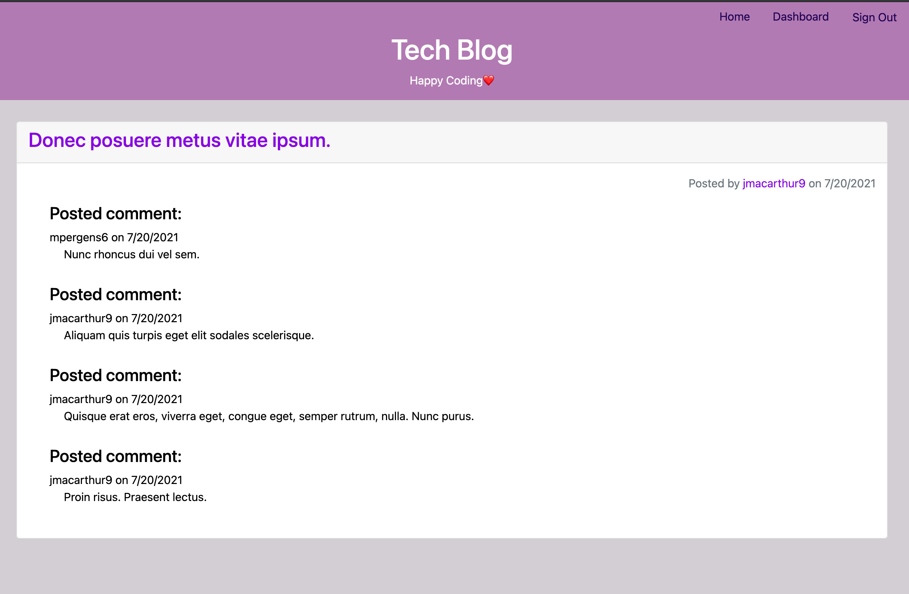

# tech-blog

# Description
Built a CMS-style blog site where developers can publish their blog posts and comment on other developers’ posts as well

# User Story
AS A developer who writes about tech
I WANT a CMS-style blog site
SO THAT I can publish articles, blog posts, and my thoughts and opinions

# Built With
- bcrypt
- connect-session-sequelize
- dotenv
- express
- express-session
- express-handlebars
- mysql2
- sequelize
- jawsDB

# Github Repo
https://github.com/salask24/tech-blog

# Heroku link
https://challenge14-techblog.herokuapp.com/

# Questions
If you have questions, email me at salask.0104@gmail.com or reach out on GitHub @salask24.

